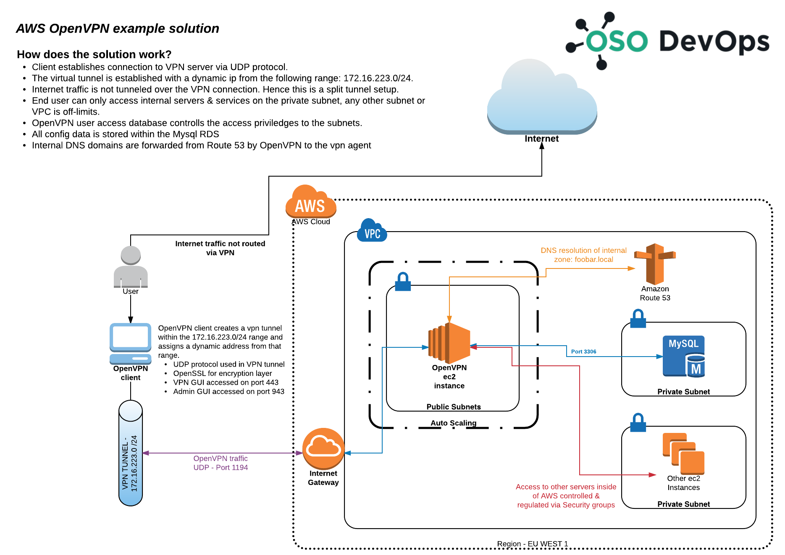

AWS OpenVpn Solution
====================
This is a deployment guide on how to get [OpenVPN](https://openvpn.net/) onto your AWS infrastructure, in order to quickly secure your infrastructure.

In this guide we will be using the [OpenVpn Access Server](https://openvpn.net/index.php/access-server/on-amazon-cloud.html) instead of the
community edition, which most engineers will be familiar with. This product comes with a nice GUI and several other features out to box allowing 
you to quickly spin up an ISO 27001 compliant VPN service.

The OpenVPN Access Server can be selected from the AWS Marketplace with different license options, based on concurrent users and size of ec2 instance.

How to deploy
=============

There are several ways to deploy this solution. In this example we are using CloudFormation and bash in the userdata field 
to complete the setup process. We have included some Ansible playbooks which could be used instead during the deployment.
However they will require the user to setup S3 buckets in their respective AWS accounts, we have also included a few short
python scripts for that. 

Once you have completed the CloudFormation deployment, please SSH onto the new ec2 instance and complete the 
OpenVPN initial installation wizard that is run the moment you SSH onto the instance. 
Hence this solution does require a bit of manual work before the solution is automated.

Post CF deployment tasks:

1. Go through the OpenVPN wizard
    1. Set a IP range for VPN tunnel traffic
    2. Set which subnets the VPN should access
    3. Create users
2. Migrate SQLite DB to RDS
3. Restart application with the RDS connection enabled
4. Deployment complete! 

How does the VPN solution work?
===============================

The OpenVPN client establishes connection to VPN server via UDP protocol.
The virtual tunnel is established with a dynamic ip from the following range: 172.16.223.0/24.
Internet traffic is not tunneled over the VPN connection. Hence this is a split VPN tunnel solution. 
End user can only access internal servers & services on the private DevOps subnet, any other subnet or VPC is off-limits.
OpenVPN user access database controls the access privileges to the subnets.
All config data is stored within the Mysql RDS
Internal DNS domains are forwarded from Route 53 by OpenVPN allowing the client to query internal domain resolution.

### Please see the diagram below:

Notes from the diagram:
* *The RDS Mysql database provides greater redundancy than the original file based SQlite database.*

